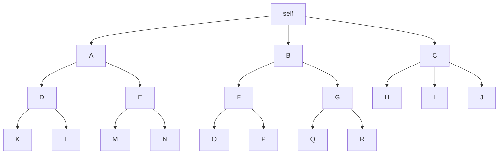

# Client
KyWeb is designed for use on Beaker's Hyperdrive protocol.

For each client, a new hyperdrive should be created and shared. This will serve as the data store, identification and frontend.

## Interface
The interface starts at the feed. The feed is a list of posts from addresses that the client has listed in [`follows`](follows.md). These posts are gathered from the [address](adress.md)es' [`feed`](feed.md) files.  
Posts are then filtered based on the address' filters (see [filters](filters.md) for more).  
After filtering, interactions are added, these are gathered from the client's [`interactions`](interactions.md), [`follows`](follows.md)' addresses' [`interactions`](interactions.md), their [`follows`](follows.md)' addresses' [`interactions`](interactions.md) and so on.  
The level of following to do is ideally set by a settings option, defaults to 3 (self, following, following, following).  

## Functioning
<!--stackedit_data:
eyJoaXN0b3J5IjpbMTI2NDY4ODI2MSwtNzY4MDg4MDYsLTE1Nj
E1ODA4NTRdfQ==
-->